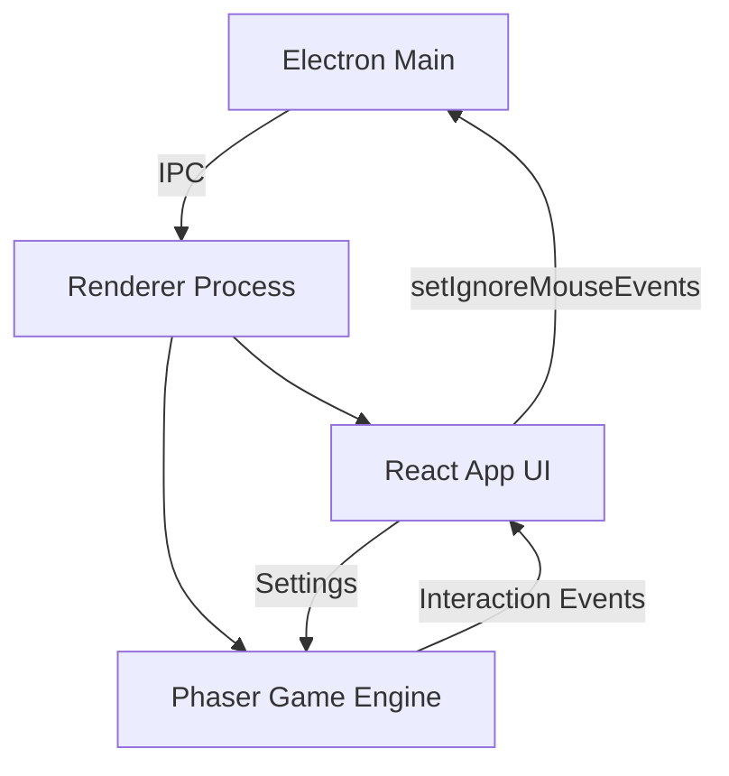

# Deskant 桌面桌宠

基于 Electron + React + Phaser 3 的桌面桌宠项目。窗口透明置顶、默认鼠标穿透，通过 Phaser 游戏引擎实现流畅的动画与交互，同时结合 React 管理 UI 界面。

## 功能概览
- **游戏引擎驱动**：引入 Phaser 3 处理桌宠渲染、动画与物理逻辑
- **透明覆盖层**：全屏工作区透明窗口，默认鼠标穿透，不遮挡底部应用
- **智能交互接管**：鼠标移入桌宠或控制中心时自动接管输入，离开后恢复穿透
- **控制中心**：React 组件实现的悬浮菜单（状态、速度、重置、退出）
- **IPC 通信**：渲染层与主进程的安全通信（退出、穿透控制、状态获取）

## 技术架构



## 项目结构
```
deskant/
├── public/
│   └── assets/                # 静态资源（桌宠图/动图）
├── src/
│   ├── main/                  # Electron 主进程
│   │   ├── main.js            # 窗口/托盘/IPC/穿透控制
│   │   └── preload.js         # 安全隔离与 API 暴露
│   └── renderer/              # 渲染进程
│       ├── components/        # React UI 组件
│       │   ├── ControlButton.jsx # 控制中心入口
│       │   ├── MenuPanel.jsx     # 设置菜单
│       │   └── StatusPanel.jsx   # 状态弹窗
│       ├── game/              # Phaser 游戏逻辑
│       │   ├── scenes/
│       │   │   └── MainScene.js  # 核心场景（桌宠逻辑）
│       │   ├── config.js         # 游戏配置
│       │   ├── EventBus.js       # React-Phaser 通信总线
│       │   └── PhaserGame.jsx    # React 包装组件
│       ├── App.jsx            # 根组件（协调 UI 与 Game）
│       └── ...
└── ...
```

## 核心模块说明

### 1. Phaser 游戏框架 (`src/renderer/game/`)
- **PhaserGame.jsx**: 初始化 Phaser 实例，配置 `transparent: true` 与 `Scale.RESIZE` 适配全屏。
- **MainScene.js**: 
  - 加载桌宠资源 (`ant-idle`, `ant-walk`)
  - 实现桌宠巡逻逻辑（位置更新、边界检测、翻转）
  - 处理交互事件 (`pointerover`, `pointerout`) 并触发穿透状态切换
- **EventBus.js**: 用于 React 组件与 Phaser 场景间的双向通信（更新设置、重置位置）。

### 2. 交互穿透系统 (`App.jsx`)
采用“默认穿透 + 动态接管”策略：
1. **默认状态**: Electron 窗口设置 `ignoreMouseEvents(true, { forward: true })`，鼠标操作穿透至底部应用。
2. **交互探测**:
   - **React UI**: 监听 DOM `mousemove`，命中 `[data-interactive]` 元素时锁定交互。
   - **Phaser Sprite**: 鼠标移入 Sprite 时触发 `set-interaction-lock` 事件，锁定交互。
3. **状态同步**: `App.jsx` 汇总 UI 锁与 Game 锁，任一激活时调用 `setIgnoreMouseEvents(false)` 接管输入。

### 3. React UI 控制层
- **ControlButton**: 右下角悬浮按钮，提供 React 侧的设置面板。
- **数据流**: 速度/重置信号通过 `props` -> `PhaserGame` -> `EventBus` -> `MainScene` 传递。

## 开发指南

### 安装依赖
```powershell
npm install
```

### 启动开发环境
同时启动 Vite 服务与 Electron 窗口：
```powershell
npm run dev
```

### 资源替换
1. 将新的图片资源放入 `public/assets/`
2. 修改 [MainScene.js](file:///d:/deskant/src/renderer/game/scenes/MainScene.js) 中的 `preload()` 方法加载新资源
3. 如果需要帧动画，请使用 `this.load.spritesheet` 并创建 Phaser 动画

### 构建打包
```powershell
npm run build   # 构建渲染层
npm run dist    # 打包应用
```

## 常见问题
- **GIF 支持**: Phaser 3 原生不直接支持 GIF 动画播放（通常只显示第一帧）。建议将 GIF 转换为 Sprite Sheet（精灵图表）以获得最佳性能与控制力。
- **多显示器**: 当前版本默认覆盖主显示器工作区。
